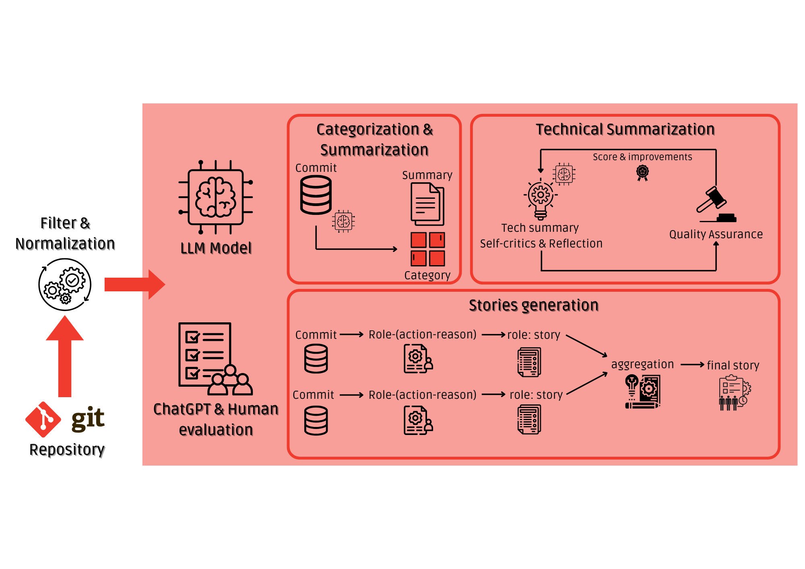

# Code Review and Project Workflow Analysis for Git Data

## Introduction
This project uses Large Language Models (LLMs) to analyze Git data, providing insights into commit messages, code diffs, and commit categorization. The goal is to enhance the code review process and project workflow analysis by automating the interpretation and summarization of changes in the codebase. This project is part of the final work for the Large Language Models course at Politecnico di Torino (PoliTO).

## Proposed Implementation

The language model used in this project is [Llama 3.2-1B-Instruct](https://huggingface.co/meta-llama/Llama-3.2-1B-Instruct). The testing and evaluation of the framework is done on the [MuJS](https://github.com/ccxvii/mujs) repository, a lightweight JavaScript interpreter.

### Commits Extractor
Extracts git commits and preprocesses them to remove irrelevant information. Filters trivial commits (e.g., minor changes, merges, readme updates) and normalizes commit messages for consistency.

### Categorization Chain
Predicts a category for each commit from a fixed list. The model sees all relevant commit information, including author, message, changed files, and code changes. Tested in zero-shot and few-shot settings.

### Summarization Chain
Generates summaries for each commit, given all relevant information. Two levels of summaries: high-level description ("summary") and detailed code changes ("Technical summary"). Only few-shot setup used.

### Quality Assurance Framework
Iterative approach inspired by [MAGIS](https://arxiv.org/abs/2403.17927). One LLM agent generates summaries, another evaluates and scores them (0-10). Summaries below a score of 8 are not accepted, ensuring accuracy and reliability.

### Story Generation
Generates stories to describe project evolution based on commits. Captures the essence of changes and their impact on the project.

## Requirements
- Python 3.12+
- Torch
- Transformers
- GitPython 

## Team Members

- [Massimo Francios](https://github.com/maxfra01)
- [Davide Monaco](https://github.com/efemcy2245)
- [Francesco Alzate](https://github.com/FrancescoAlzate)